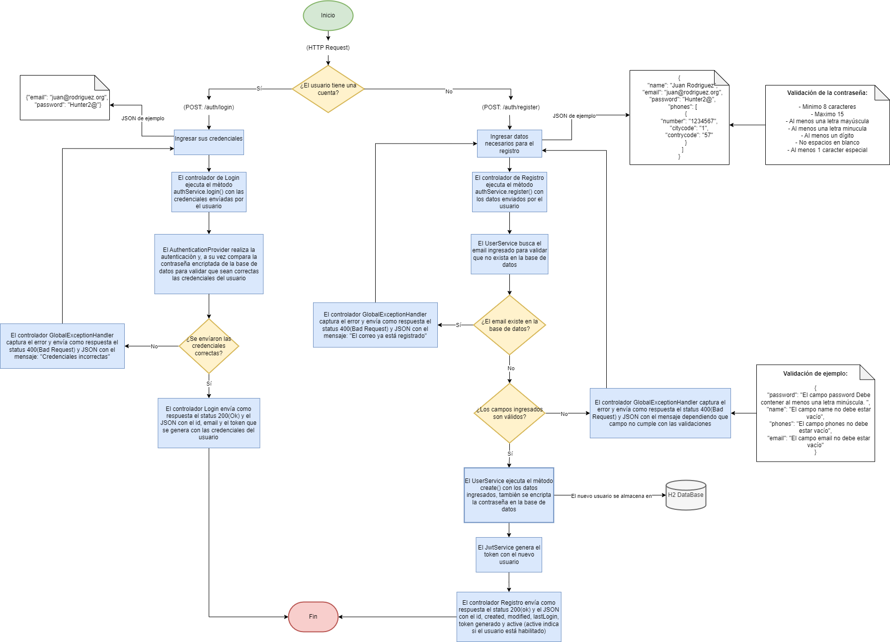

### EXPRESION REGULAR O VALIDACIÓN DE LA CONTRASEÑA

- Minimo 8 caracteres
- Maximo 15
- Al menos una letra mayúscula
- Al menos una letra minucula
- Al menos un dígito
- No espacios en blanco
- Al menos 1 caracter especial

### BASE DE DATOS ###

Se está utilizando H2 DataBase: Almacena la información del usuario en una base de datos en memoria
Utilizar esta Base de datos en memoria agiliza las pruebas, luego se implementa una base de datos física 
para la persistencia de los registros.

### URL de la documentación de las API ###
http://localhost:8080/swagger-ui/index.html

### API Registro ###
URL: http://localhost:8080/auth/register

JSON de ejemplo para registro
{
    "name": "Juan Rodriguez",
    "email": "juan@rodriguez.org",
    "password": "Hunter2@",
    "phones": [
        {
            "number": "1234567",
            "citycode": "1",
            "contrycode": "57"
        }
    ]
}

El registro retorna el JSON con los siguientes campos:
○ id: id del usuario
○ created: fecha de creación del usuario
○ modified: fecha de la última actualización de usuario
○ last_login: del último ingreso
○ token: token de acceso de la API
○ isactive: Indica si el usuario sigue habilitado dentro del sistema

### API Login  ###
URL: http://localhost:8080/auth/login

JSON de ejemplo para el login
{
   "email": "juan@rodriguez.org",
    "password": "Hunter2@"
}

El Login retorna el JSON con los siguientes campos:
○ email: unico de cada usuario
○ token: token de acceso de la API

### Diagrama de la Solucion  ###

